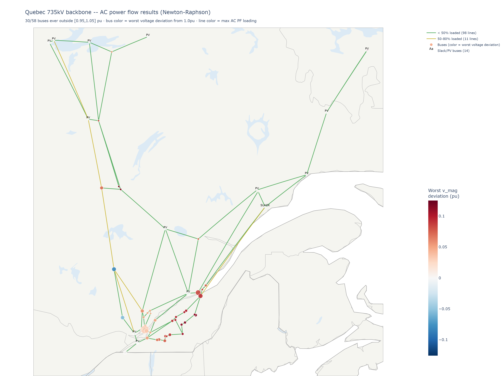

# Power flow results

## LOPF (linear optimal power flow) -- `elec_solved.nc`

Solved on the main 315kV working network's largest island (205 buses) over a one-week window
(2022-01-01 to 2022-01-07, 168 hourly snapshots).

- **0% load shed.** Every hour's demand is fully served from the modeled fleet.
- Mean demand ~30,200 MW, calibrated against real whole-January-2022 system demand
  (`historique-demande-electricite-quebec.csv`).
- Max line loading ~78.5%, **0 lines >= 90% loaded** -- down from ~96% (1 line >= 90%) before the
  line reactance correction and series compensation below; security margin (`s_max_pu`) is still
  relaxed from PyPSA-Earth's default 0.7 to 1.0, see
  [ASSUMPTIONS_AND_LIMITATIONS.md](ASSUMPTIONS_AND_LIMITATIONS.md) for why that relaxation exists.
  No congestion close-up map is generated any more (`visualize_congestion_zoom.py` finds nothing
  to zoom into, by design, when no line clears the 90% threshold).

## DC power flow

Run via `run_pf.py --method lpf` as a linear sanity check against the LOPF dispatch. Has been
clean throughout this project on every network tried -- no convergence issues at any stage.

## AC power flow (full nonlinear Newton-Raphson)

Line parameters (r/x/b) come from Hydro-Quebec's own line-characteristics table -- see
[DATA_SOURCES.md](DATA_SOURCES.md). Current state:

| Network | Convergence at current demand |
|---|---|
| 315kV (`elec_solved.nc`, 205 buses) | 0/168 -- see the 315kV section below |
| 735kV (`elec_735kv.nc`, 58 buses, 109 lines) | **168/168** |

### Fixing divergence on the 735kV network: circuit count and series compensation

Two fixes, applied together:

**Circuit count** (`correct_sending_end_circuits.py`) -- five corridors leaving Quebec's major
generating stations (114-1291, 114-148, 340-457, 66-457, 651-25) were modeled with only 1-2 of
their real 3 parallel circuits, overstating effective series reactance on exactly the lines under
the most transfer stress. Corrected to 3 total circuits per corridor (`num_parallel`), with r/x/b
recomputed from Hydro-Quebec's per-km rates accordingly.

**Series compensation** (`apply_series_compensation.py`) -- a capacitor bank modeled in series
with the conductor on 15 lines: the ten longest lines (250-500km) feeding buses 308, 1291, and 312
(found via continuation power flow to be points of AC PF voltage collapse; genuine collapse,
confirmed by Newton-Raphson's Jacobian going exactly singular there, not a solver quirk), plus the
five lines (162, 156, 1938, 1049, 1448) carrying the highest transmission angles on the network
(found via a DC power-flow angle check). Modeled as `x_new = x * (1 - 0.7)` -- a 70% reduction of
each line's own reactance. Needed because these buses and corridors have no local
voltage-controlling generation, so voltage/angle depends entirely on how much drop accumulates
over a very long, high-reactance line; cutting that reactance directly raises the loadability
limit. `COMPENSATION_FRACTION = 0.70` is a generic, tuned-not-measured assumption -- see
[ASSUMPTIONS_AND_LIMITATIONS.md](ASSUMPTIONS_AND_LIMITATIONS.md).

Result: **168/168 at current (100%) demand**, max line loading 79.6% (0 lines >= 90%).

### What is still open on the 735kV network

- **Light-load overvoltage is not mitigated.** The long lines' own charging pushes voltage up to
  about 1.13pu: 29 of 58 buses exceed 1.05pu at some point over the week (3 buses fall below
  0.95pu). Series compensation and circuit-count correction don't address this -- they raise
  transfer capacity under heavy load, not reactive charging at light load. A shunt reactor
  (`ShuntImpedance`) at each affected bus is the standard fix; not yet applied.
- **Generator Q limits aren't enforced.** PV buses hold voltage with effectively unlimited
  reactive power -- some sending buses supply several GVAr at exactly 1.00pu, which a real
  generator's capability curve wouldn't allow.

### The 315kV network

0/168 under AC PF. One known setup gap: `run_pf.py` doesn't copy the LOPF dispatch into `p_set`
(which `n.pf()` reads), so on this network every generator, storage unit and link injects zero
real power in that test and the slack carries the whole ~30 GW load. With the dispatch synced it
still fails (0/168), and the divergence localizes to two areas: a radial spur of buses 240, 1548,
1762, 1772, 2207, 3719, 1693, 3836 and 2812 (with it removed, the lowest-demand hour converges),
and, at higher demand, a wider set of buses that includes 308 and 469 -- also problem buses on the
735kV network. Root cause not yet found.
